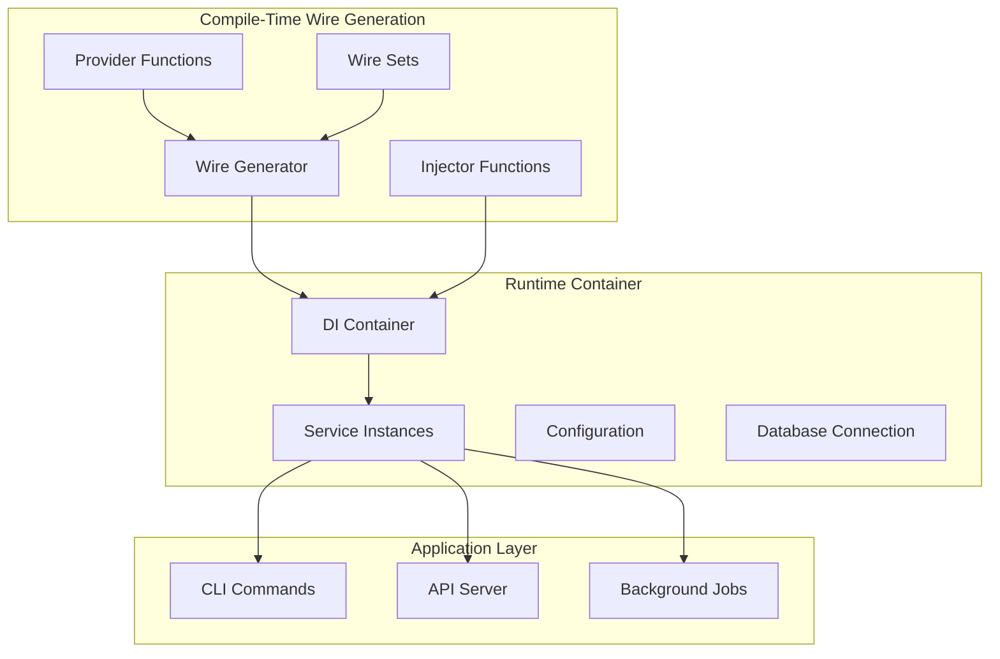
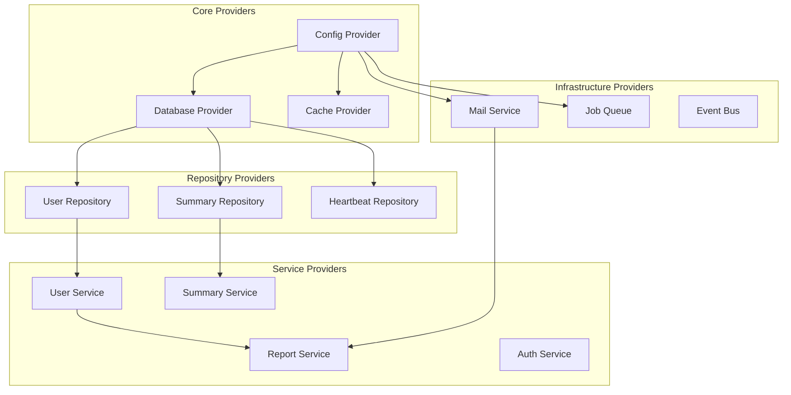

# Architecture Alternative 1: Wire-based Dependency Injection

## Overview

This alternative proposes adopting Google's Wire dependency injection framework to replace the current manual service construction with compile-time dependency injection. This approach maintains Go's explicit nature while solving circular dependency issues and improving testability.

## Key Principles

1. **Compile-time DI**: Dependencies resolved at build time, not runtime
2. **Provider Functions**: Services created via provider functions with explicit dependencies
3. **Wire Sets**: Logical grouping of related providers
4. **Interface-based Design**: All services communicate through interfaces
5. **Lifecycle Management**: Coordinated startup and shutdown

## Architecture Components

### 1. Dependency Injection Structure



### 2. Service Provider Architecture



## Implementation Details

### 1. Wire Provider Functions

```go
// wire/providers.go
package wire

import (
    "github.com/google/wire"
    "github.com/muety/wakapi/config"
    "github.com/muety/wakapi/services"
    "gorm.io/gorm"
)

// Core Infrastructure Providers
func ProvideConfig(configFile string) (*config.Config, error) {
    return config.Load(configFile, version), nil
}

func ProvideDatabase(cfg *config.Config) (*gorm.DB, func(), error) {
    db, sqlDB, err := utilities.InitDB(cfg)
    cleanup := func() {
        if sqlDB != nil {
            sqlDB.Close()
        }
    }
    return db, cleanup, err
}

func ProvideCache(cfg *config.Config) (*cache.Cache, error) {
    return cache.New(6*time.Hour, 6*time.Hour), nil
}

// Repository Providers
func ProvideUserRepository(db *gorm.DB) repositories.IUserRepository {
    return repositories.NewUserRepository(db)
}

func ProvideSummaryRepository(db *gorm.DB) repositories.ISummaryRepository {
    return repositories.NewSummaryRepository(db)
}

// Service Providers
func ProvideUserService(
    repo repositories.IUserRepository,
    cfg *config.Config,
) services.IUserService {
    return services.NewUserService(repo, cfg)
}

func ProvideSummaryService(
    repo repositories.ISummaryRepository,
    userService services.IUserService,
    cfg *config.Config,
) services.ISummaryService {
    return services.NewSummaryService(repo, userService, cfg)
}

func ProvideReportService(
    userService services.IUserService,
    summaryService services.ISummaryService,
    mailService services.IMailService,
    cfg *config.Config,
    db *gorm.DB,
) services.IReportService {
    return services.NewReportService(
        userService,
        summaryService,
        mailService,
        cfg,
        db,
    )
}
```

### 2. Wire Sets for Logical Grouping

```go
// wire/sets.go
package wire

import "github.com/google/wire"

// CoreSet provides basic infrastructure dependencies
var CoreSet = wire.NewSet(
    ProvideConfig,
    ProvideDatabase,
    ProvideCache,
    ProvideEventBus,
    ProvideJobQueue,
)

// RepositorySet provides all repository implementations
var RepositorySet = wire.NewSet(
    ProvideUserRepository,
    ProvideSummaryRepository,
    ProvideHeartbeatRepository,
    ProvideLeaderboardRepository,
)

// ServiceSet provides all business services
var ServiceSet = wire.NewSet(
    ProvideUserService,
    ProvideSummaryService,
    ProvideReportService,
    ProvideAuthService,
    ProvideLeaderboardService,
    ProvideHousekeepingService,
)

// InfrastructureSet provides external service integrations
var InfrastructureSet = wire.NewSet(
    ProvideMailService,
    ProvideHTTPClient,
    ProvideLogger,
)

// AllServices combines all service sets
var AllServices = wire.NewSet(
    CoreSet,
    RepositorySet,
    ServiceSet,
    InfrastructureSet,
)
```

### 3. Application Containers

```go
// internal/container/container.go
package container

import (
    "context"
    "sync"
    
    "github.com/muety/wakapi/services"
)

// ApplicationContainer holds all application dependencies
type ApplicationContainer struct {
    // Core services
    UserService    services.IUserService
    SummaryService services.ISummaryService
    ReportService  services.IReportService
    AuthService    services.IAuthService
    
    // Infrastructure
    DB       *gorm.DB
    Cache    *cache.Cache
    JobQueue *river.Client
    
    // Cleanup functions
    cleanupFuncs []func()
    mu           sync.Mutex
}

// Cleanup gracefully shuts down all resources
func (c *ApplicationContainer) Cleanup() {
    c.mu.Lock()
    defer c.mu.Unlock()
    
    for i := len(c.cleanupFuncs) - 1; i >= 0; i-- {
        c.cleanupFuncs[i]()
    }
}

// AddCleanup registers a cleanup function
func (c *ApplicationContainer) AddCleanup(fn func()) {
    c.mu.Lock()
    defer c.mu.Unlock()
    c.cleanupFuncs = append(c.cleanupFuncs, fn)
}
```

### 4. Wire Injector Functions

```go
//go:build wireinject
// +build wireinject

// wire/injectors.go
package wire

import (
    "github.com/google/wire"
    "github.com/muety/wakapi/internal/container"
)

// InitializeAPIContainer creates a container for the API server
func InitializeAPIContainer(configFile string) (*container.ApplicationContainer, func(), error) {
    wire.Build(
        AllServices,
        wire.Struct(new(container.ApplicationContainer), "*"),
    )
    return &container.ApplicationContainer{}, nil, nil
}

// InitializeJobContainer creates a container for background jobs
func InitializeJobContainer(configFile string) (*container.JobContainer, func(), error) {
    wire.Build(
        CoreSet,
        ServiceSet,
        wire.Struct(new(container.JobContainer), "*"),
    )
    return &container.JobContainer{}, nil, nil
}

// InitializeCLIContainer creates a container for CLI commands
func InitializeCLIContainer(configFile string) (*container.CLIContainer, func(), error) {
    wire.Build(
        CoreSet,
        RepositorySet,
        wire.Struct(new(container.CLIContainer), "*"),
    )
    return &container.CLIContainer{}, nil, nil
}
```

### 5. Refactored CLI Structure

```go
// cmd/serve.go
package cmd

import (
    "context"
    "os"
    "os/signal"
    "syscall"
    
    "github.com/spf13/cobra"
    "github.com/muety/wakapi/wire"
    "github.com/muety/wakapi/internal/api"
)

var serveCmd = &cobra.Command{
    Use:   "serve",
    Short: "Start the Wakapi API server",
    RunE: func(cmd *cobra.Command, args []string) error {
        // Initialize container with Wire
        container, cleanup, err := wire.InitializeAPIContainer(cfgFile)
        if err != nil {
            return fmt.Errorf("failed to initialize container: %w", err)
        }
        defer cleanup()
        
        // Create API server with injected dependencies
        apiServer := api.NewServer(container)
        
        // Setup graceful shutdown
        ctx, cancel := context.WithCancel(context.Background())
        defer cancel()
        
        go func() {
            sigChan := make(chan os.Signal, 1)
            signal.Notify(sigChan, syscall.SIGINT, syscall.SIGTERM)
            <-sigChan
            cancel()
        }()
        
        // Start server
        return apiServer.Start(ctx)
    },
}
```

### 6. Improved Service Interfaces

```go
// services/interfaces.go
package services

import (
    "context"
    "time"
)

// Lifecycle interface for services that need startup/shutdown coordination
type Lifecycle interface {
    Start(ctx context.Context) error
    Stop(ctx context.Context) error
}

// HealthChecker interface for services that support health checks
type HealthChecker interface {
    HealthCheck(ctx context.Context) error
}

// IUserService with explicit dependencies
type IUserService interface {
    Lifecycle
    HealthChecker
    
    GetByID(ctx context.Context, id string) (*models.User, error)
    Create(ctx context.Context, user *models.User) error
    Update(ctx context.Context, user *models.User) error
    // ... other methods
}

// IReportService with explicit dependencies
type IReportService interface {
    Lifecycle
    
    SendReport(ctx context.Context, user *models.User, duration time.Duration) error
    SendWeeklyReports(ctx context.Context) error
}
```

## Benefits

### 1. Compile-time Safety
- Dependencies resolved at build time
- Circular dependency detection
- Missing dependency errors caught early

### 2. Improved Testability
- Easy to inject mock implementations
- Clear dependency boundaries
- Isolated unit testing

### 3. Lifecycle Management
- Coordinated startup and shutdown
- Resource cleanup guarantees
- Health check integration

### 4. Configuration Management
- Centralized configuration injection
- Environment-specific containers
- Type-safe configuration

### 5. Development Experience
- Clear dependency graphs
- Auto-generated wire_gen.go
- IDE support for dependency navigation

## Migration Strategy

### Phase 1: Interface Extraction
1. Extract interfaces for all services
2. Update existing code to use interfaces
3. Add lifecycle methods to key services

### Phase 2: Wire Integration
1. Add Wire as a dependency
2. Create provider functions for existing services
3. Generate initial injector functions

### Phase 3: CLI Refactoring
1. Update commands to use Wire containers
2. Add graceful shutdown handling
3. Implement health check endpoints

### Phase 4: Testing Improvements
1. Create mock implementations
2. Update unit tests to use dependency injection
3. Add integration tests with test containers

## Development Workflow

### 1. Adding New Services
```bash
# 1. Create service interface and implementation
# 2. Add provider function to wire/providers.go
# 3. Add to appropriate wire set
# 4. Regenerate wire code
go generate ./wire
```

### 2. Testing with Mocks
```go
// Use Wire for test containers
func TestUserService(t *testing.T) {
    container := &container.TestContainer{
        UserService: &mocks.MockUserService{},
        DB:         testDB,
    }
    
    // Test with injected dependencies
}
```

### 3. Configuration Management
```go
// Environment-specific providers
func ProvideTestConfig() *config.Config {
    cfg := config.Default()
    cfg.Database.Host = "localhost"
    cfg.Database.Name = "wakapi_test"
    return cfg
}
```

## Wire Configuration Files

### wire.go
```go
//go:generate wire
package main

import (
    "github.com/muety/wakapi/wire"
)
```

### Makefile Integration
```makefile
.PHONY: wire-gen
wire-gen:
	cd wire && wire

.PHONY: build
build: wire-gen
	go build -o bin/wakapi ./cmd/wakapi

.PHONY: test
test: wire-gen
	go test ./...
```

This Wire-based approach provides compile-time dependency injection while maintaining Go's explicit nature and improving the overall architecture quality.