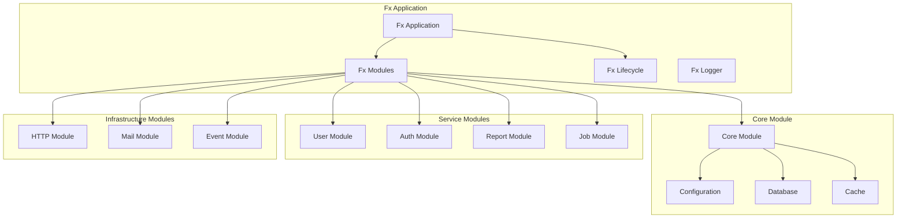
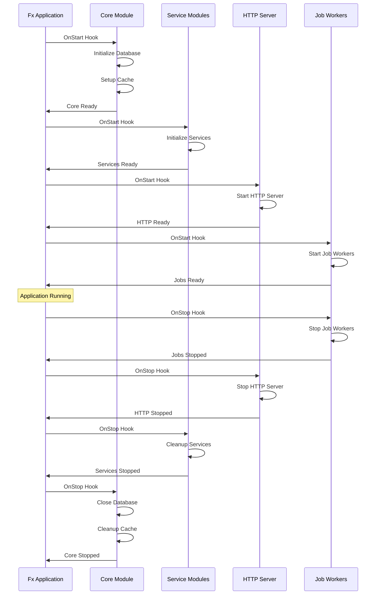

# Architecture Alternative 2: Uber Fx Framework

## Overview

This alternative proposes adopting Uber's Fx dependency injection framework to create a more dynamic, lifecycle-aware application architecture. Fx provides runtime dependency injection with strong lifecycle management, event hooks, and graceful shutdown capabilities.

## Key Principles

1. **Runtime DI**: Dependencies resolved at application startup
2. **Lifecycle Hooks**: Coordinated startup and shutdown sequences
3. **Event-Driven Architecture**: Built-in event system for decoupling
4. **Module System**: Logical grouping of related functionality
5. **Graceful Shutdown**: Automatic resource cleanup and shutdown coordination

## Architecture Components

### 1. Fx Application Structure



### 2. Service Lifecycle Management



## Implementation Details

### 1. Fx Module Structure

```go
// internal/modules/core.go
package modules

import (
    "context"
    "database/sql"
    
    "go.uber.org/fx"
    "go.uber.org/zap"
    "gorm.io/gorm"
    
    "github.com/muety/wakapi/config"
    "github.com/muety/wakapi/internal/utilities"
)

// CoreModule provides core infrastructure dependencies
var CoreModule = fx.Module("core",
    fx.Provide(
        NewConfig,
        NewDatabase,
        NewCache,
        NewLogger,
        NewEventBus,
    ),
)

// NewConfig provides application configuration
func NewConfig() (*config.Config, error) {
    return config.Load("", ""), nil
}

// NewDatabase provides database connection with lifecycle management
func NewDatabase(cfg *config.Config, lc fx.Lifecycle) (*gorm.DB, error) {
    db, sqlDB, err := utilities.InitDB(cfg)
    if err != nil {
        return nil, err
    }
    
    lc.Append(fx.Hook{
        OnStart: func(ctx context.Context) error {
            return db.Exec("SELECT 1").Error
        },
        OnStop: func(ctx context.Context) error {
            return sqlDB.Close()
        },
    })
    
    return db, nil
}

// NewCache provides application cache
func NewCache(cfg *config.Config, lc fx.Lifecycle) (*cache.Cache, error) {
    c := cache.New(6*time.Hour, 6*time.Hour)
    
    lc.Append(fx.Hook{
        OnStop: func(ctx context.Context) error {
            c.Flush()
            return nil
        },
    })
    
    return c, nil
}

// NewLogger provides structured logger
func NewLogger(cfg *config.Config) (*zap.Logger, error) {
    if cfg.App.Environment == "development" {
        return zap.NewDevelopment()
    }
    return zap.NewProduction()
}
```

### 2. Service Module Implementation

```go
// internal/modules/services.go
package modules

import (
    "context"
    
    "go.uber.org/fx"
    "gorm.io/gorm"
    
    "github.com/muety/wakapi/services"
    "github.com/muety/wakapi/repositories"
)

// ServiceModule provides all business services
var ServiceModule = fx.Module("services",
    fx.Provide(
        // Repositories
        NewUserRepository,
        NewSummaryRepository,
        NewHeartbeatRepository,
        
        // Services
        NewUserService,
        NewSummaryService,
        NewReportService,
        NewAuthService,
        NewLeaderboardService,
    ),
)

// Repository constructors
func NewUserRepository(db *gorm.DB) repositories.IUserRepository {
    return repositories.NewUserRepository(db)
}

func NewSummaryRepository(db *gorm.DB) repositories.ISummaryRepository {
    return repositories.NewSummaryRepository(db)
}

// Service constructors with lifecycle hooks
func NewUserService(
    repo repositories.IUserRepository,
    cfg *config.Config,
    lc fx.Lifecycle,
    logger *zap.Logger,
) services.IUserService {
    svc := services.NewUserService(repo, cfg)
    
    lc.Append(fx.Hook{
        OnStart: func(ctx context.Context) error {
            logger.Info("Starting UserService")
            return svc.Start(ctx)
        },
        OnStop: func(ctx context.Context) error {
            logger.Info("Stopping UserService")
            return svc.Stop(ctx)
        },
    })
    
    return svc
}

func NewReportService(
    userService services.IUserService,
    summaryService services.ISummaryService,
    mailService services.IMailService,
    cfg *config.Config,
    db *gorm.DB,
    lc fx.Lifecycle,
    logger *zap.Logger,
) services.IReportService {
    svc := services.NewReportService(
        userService,
        summaryService,
        mailService,
        cfg,
        db,
    )
    
    lc.Append(fx.Hook{
        OnStart: func(ctx context.Context) error {
            logger.Info("Starting ReportService")
            return svc.Start(ctx)
        },
        OnStop: func(ctx context.Context) error {
            logger.Info("Stopping ReportService")
            return svc.Stop(ctx)
        },
    })
    
    return svc
}
```

### 3. HTTP Server Module

```go
// internal/modules/http.go
package modules

import (
    "context"
    "net/http"
    "time"
    
    "go.uber.org/fx"
    "go.uber.org/zap"
    
    "github.com/muety/wakapi/internal/api"
    "github.com/muety/wakapi/services"
)

// HTTPModule provides HTTP server functionality
var HTTPModule = fx.Module("http",
    fx.Provide(
        NewHTTPServer,
        NewAPIHandler,
    ),
    fx.Invoke(RegisterHTTPServer),
)

// HTTPServerParams groups HTTP server dependencies
type HTTPServerParams struct {
    fx.In
    
    Config   *config.Config
    Handler  http.Handler
    Logger   *zap.Logger
}

// NewHTTPServer creates HTTP server with configuration
func NewHTTPServer(params HTTPServerParams) *http.Server {
    return &http.Server{
        Addr:         fmt.Sprintf(":%d", params.Config.Server.Port),
        Handler:      params.Handler,
        ReadTimeout:  time.Duration(params.Config.Server.TimeoutSec) * time.Second,
        WriteTimeout: time.Duration(params.Config.Server.TimeoutSec) * time.Second,
    }
}

// APIHandlerParams groups API handler dependencies
type APIHandlerParams struct {
    fx.In
    
    UserService    services.IUserService
    SummaryService services.ISummaryService
    ReportService  services.IReportService
    AuthService    services.IAuthService
    Config         *config.Config
    Logger         *zap.Logger
}

// NewAPIHandler creates API handler with all dependencies
func NewAPIHandler(params APIHandlerParams) http.Handler {
    return api.NewHandler(api.HandlerConfig{
        UserService:    params.UserService,
        SummaryService: params.SummaryService,
        ReportService:  params.ReportService,
        AuthService:    params.AuthService,
        Config:         params.Config,
        Logger:         params.Logger,
    })
}

// RegisterHTTPServer registers HTTP server with lifecycle
func RegisterHTTPServer(lc fx.Lifecycle, server *http.Server, logger *zap.Logger) {
    lc.Append(fx.Hook{
        OnStart: func(ctx context.Context) error {
            logger.Info("Starting HTTP server", zap.String("addr", server.Addr))
            go func() {
                if err := server.ListenAndServe(); err != nil && err != http.ErrServerClosed {
                    logger.Error("HTTP server error", zap.Error(err))
                }
            }()
            return nil
        },
        OnStop: func(ctx context.Context) error {
            logger.Info("Stopping HTTP server")
            return server.Shutdown(ctx)
        },
    })
}
```

### 4. Job Processing Module

```go
// internal/modules/jobs.go
package modules

import (
    "context"
    
    "go.uber.org/fx"
    "go.uber.org/zap"
    "github.com/riverqueue/river"
    
    "github.com/muety/wakapi/internal/jobs"
    "github.com/muety/wakapi/services"
)

// JobModule provides background job processing
var JobModule = fx.Module("jobs",
    fx.Provide(
        NewRiverClient,
        NewJobWorkers,
    ),
    fx.Invoke(RegisterJobWorkers),
)

// JobParams groups job-related dependencies
type JobParams struct {
    fx.In
    
    Config        *config.Config
    ReportService services.IReportService
    Logger        *zap.Logger
}

// NewRiverClient creates River job client
func NewRiverClient(params JobParams, lc fx.Lifecycle) (*river.Client[pgx.Tx], error) {
    workers := river.NewWorkers()
    
    client, err := jobs.NewRiverClient(context.Background(), workers, params.Config)
    if err != nil {
        return nil, err
    }
    
    lc.Append(fx.Hook{
        OnStart: func(ctx context.Context) error {
            params.Logger.Info("Starting River job client")
            return client.Start(ctx)
        },
        OnStop: func(ctx context.Context) error {
            params.Logger.Info("Stopping River job client")
            return client.Stop(ctx)
        },
    })
    
    return client, nil
}

// NewJobWorkers creates job worker implementations
func NewJobWorkers(params JobParams) *jobs.Workers {
    return &jobs.Workers{
        ReportService: params.ReportService,
        Logger:        params.Logger,
    }
}

// RegisterJobWorkers registers periodic jobs
func RegisterJobWorkers(
    client *river.Client[pgx.Tx],
    workers *jobs.Workers,
    logger *zap.Logger,
) {
    // Register weekly report job
    _, err := client.PeriodicJobs().Add(&river.PeriodicJob{
        Schedule: jobs.EVERY_MONDAY_MORNING,
        JobArgs:  &jobs.WeeklyReportArgs{},
    })
    if err != nil {
        logger.Error("Failed to register weekly report job", zap.Error(err))
    } else {
        logger.Info("Registered weekly report job")
    }
}
```

### 5. Event-Driven Module

```go
// internal/modules/events.go
package modules

import (
    "context"
    
    "go.uber.org/fx"
    "go.uber.org/zap"
    
    "github.com/muety/wakapi/internal/events"
    "github.com/muety/wakapi/services"
)

// EventModule provides event handling capabilities
var EventModule = fx.Module("events",
    fx.Provide(
        NewEventBus,
        NewEventHandlers,
    ),
    fx.Invoke(RegisterEventHandlers),
)

// NewEventBus creates application event bus
func NewEventBus(lc fx.Lifecycle, logger *zap.Logger) *events.Bus {
    bus := events.NewBus()
    
    lc.Append(fx.Hook{
        OnStart: func(ctx context.Context) error {
            logger.Info("Starting event bus")
            return bus.Start(ctx)
        },
        OnStop: func(ctx context.Context) error {
            logger.Info("Stopping event bus")
            return bus.Stop(ctx)
        },
    })
    
    return bus
}

// EventHandlerParams groups event handler dependencies
type EventHandlerParams struct {
    fx.In
    
    UserService   services.IUserService
    ReportService services.IReportService
    Logger        *zap.Logger
}

// NewEventHandlers creates event handler implementations
func NewEventHandlers(params EventHandlerParams) *events.Handlers {
    return &events.Handlers{
        UserService:   params.UserService,
        ReportService: params.ReportService,
        Logger:        params.Logger,
    }
}

// RegisterEventHandlers registers event handlers with the bus
func RegisterEventHandlers(bus *events.Bus, handlers *events.Handlers) {
    bus.Subscribe("user.created", handlers.HandleUserCreated)
    bus.Subscribe("user.updated", handlers.HandleUserUpdated)
    bus.Subscribe("report.requested", handlers.HandleReportRequested)
}
```

### 6. Refactored CLI Structure

```go
// cmd/serve.go
package cmd

import (
    "context"
    
    "github.com/spf13/cobra"
    "go.uber.org/fx"
    
    "github.com/muety/wakapi/internal/modules"
)

var serveCmd = &cobra.Command{
    Use:   "serve",
    Short: "Start the Wakapi API server",
    RunE: func(cmd *cobra.Command, args []string) error {
        app := fx.New(
            // Core modules
            modules.CoreModule,
            modules.ServiceModule,
            modules.HTTPModule,
            modules.JobModule,
            modules.EventModule,
            
            // Application options
            fx.StopTimeout(30*time.Second),
        )
        
        // Start application and block
        app.Run()
        return nil
    },
}

// Alternative: context-aware startup
var serveWithContextCmd = &cobra.Command{
    Use:   "serve-ctx",
    Short: "Start the Wakapi API server with context support",
    RunE: func(cmd *cobra.Command, args []string) error {
        ctx, cancel := context.WithCancel(context.Background())
        defer cancel()
        
        app := fx.New(
            modules.CoreModule,
            modules.ServiceModule,
            modules.HTTPModule,
            modules.JobModule,
            modules.EventModule,
        )
        
        return app.Start(ctx)
    },
}
```

### 7. Testing Module

```go
// internal/modules/testing.go
package modules

import (
    "go.uber.org/fx"
    "go.uber.org/fx/fxtest"
    
    "github.com/muety/wakapi/internal/mocks"
)

// TestModule provides test-specific dependencies
var TestModule = fx.Module("testing",
    fx.Provide(
        NewTestConfig,
        NewTestDatabase,
        NewMockServices,
    ),
    fx.Decorate(DecorateMockServices),
)

// NewTestConfig provides test configuration
func NewTestConfig() *config.Config {
    cfg := config.Default()
    cfg.Database.Name = "wakapi_test"
    cfg.App.Environment = "test"
    return cfg
}

// NewTestDatabase provides in-memory test database
func NewTestDatabase() (*gorm.DB, error) {
    return gorm.Open(sqlite.Open(":memory:"), &gorm.Config{})
}

// NewMockServices provides mock implementations
func NewMockServices() *mocks.Services {
    return &mocks.Services{
        UserService:   &mocks.MockUserService{},
        ReportService: &mocks.MockReportService{},
    }
}

// DecorateMockServices replaces real services with mocks in tests
func DecorateMockServices(mocks *mocks.Services) services.IServices {
    return mocks
}

// Test helper function
func NewTestApp(tb fxtest.TB, opts ...fx.Option) *fxtest.App {
    return fxtest.New(tb,
        append([]fx.Option{
            modules.CoreModule,
            TestModule,
        }, opts...)...,
    )
}
```

### 8. Configuration with Environment Support

```go
// internal/modules/config.go
package modules

import (
    "go.uber.org/fx"
    
    "github.com/muety/wakapi/config"
)

// ConfigModule provides environment-specific configuration
var ConfigModule = fx.Module("config",
    fx.Provide(
        fx.Annotated{
            Name: "development",
            Target: func() *config.Config {
                cfg := config.Load("", "")
                cfg.App.Environment = "development"
                return cfg
            },
        },
        fx.Annotated{
            Name: "production",
            Target: func() *config.Config {
                cfg := config.Load("", "")
                cfg.App.Environment = "production"
                return cfg
            },
        },
    ),
)

// Environment-specific application builders
func NewDevelopmentApp() *fx.App {
    return fx.New(
        modules.CoreModule,
        modules.ServiceModule,
        modules.HTTPModule,
        fx.Supply(fx.Annotated{Name: "development"}),
    )
}

func NewProductionApp() *fx.App {
    return fx.New(
        modules.CoreModule,
        modules.ServiceModule,
        modules.HTTPModule,
        modules.JobModule,
        fx.Supply(fx.Annotated{Name: "production"}),
    )
}
```

## Benefits

### 1. Lifecycle Management
- Automatic startup and shutdown coordination
- Graceful error handling during initialization
- Resource cleanup guarantees

### 2. Event-Driven Architecture
- Built-in event system for decoupling
- Async processing capabilities
- Easy to add cross-cutting concerns

### 3. Testability
- Easy mock injection with decorators
- Isolated module testing
- Test-specific configurations

### 4. Development Experience
- Clear module boundaries
- Dependency visualization with fx.Visualize
- Runtime dependency validation

### 5. Observability
- Built-in logging and metrics
- Health check integration
- Performance monitoring hooks

## Migration Strategy

### Phase 1: Module Extraction
1. Group related functionality into modules
2. Define clear module interfaces
3. Add lifecycle hooks to existing services

### Phase 2: Fx Integration
1. Add Fx as a dependency
2. Create core modules (config, database, cache)
3. Convert one service module at a time

### Phase 3: CLI Modernization
1. Update commands to use Fx applications
2. Add graceful shutdown handling
3. Environment-specific configurations

### Phase 4: Event System
1. Implement event bus
2. Convert synchronous calls to events where appropriate
3. Add event-driven features

## Development Workflow

### 1. Adding New Modules
```go
// Create new module
var NewModule = fx.Module("new_feature",
    fx.Provide(NewService),
    fx.Invoke(RegisterHandlers),
)

// Add to application
app := fx.New(
    modules.CoreModule,
    modules.ServiceModule,
    NewModule, // Add new module
)
```

### 2. Testing with Fx
```go
func TestService(t *testing.T) {
    app := modules.NewTestApp(t,
        fx.Provide(func() *TestData {
            return &TestData{Value: "test"}
        }),
    )
    defer app.RequireStop()
    
    app.RequireStart()
    
    // Test logic here
}
```

### 3. Visualization and Debugging
```go
// Generate dependency graph
app := fx.New(
    modules.CoreModule,
    modules.ServiceModule,
    fx.Visualize(os.Stdout),
)
```

## Fx-Specific Features

### 1. Parameter Groups
```go
type HTTPServerParams struct {
    fx.In
    
    Config  *config.Config
    Logger  *zap.Logger
    Handler http.Handler `name:"api"`
}
```

### 2. Result Groups
```go
type HandlerResult struct {
    fx.Out
    
    Handler http.Handler `name:"api"`
}
```

### 3. Optional Dependencies
```go
type OptionalParams struct {
    fx.In
    
    Required *RequiredService
    Optional *OptionalService `optional:"true"`
}
```

This Fx-based approach provides a robust, lifecycle-aware dependency injection system with strong testing support and excellent development tooling.