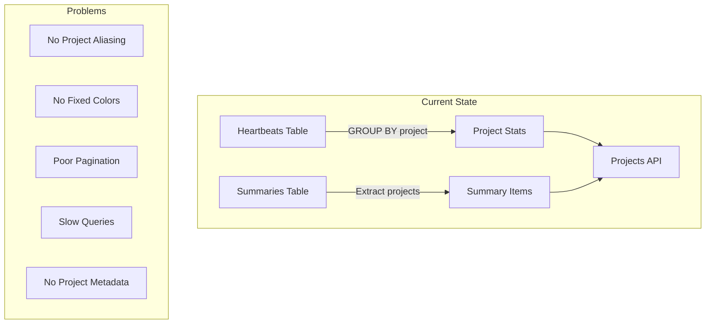
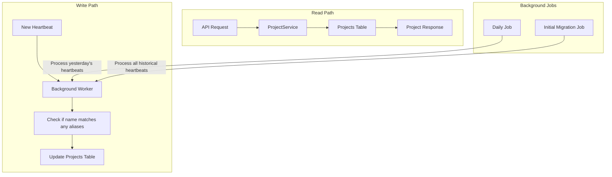
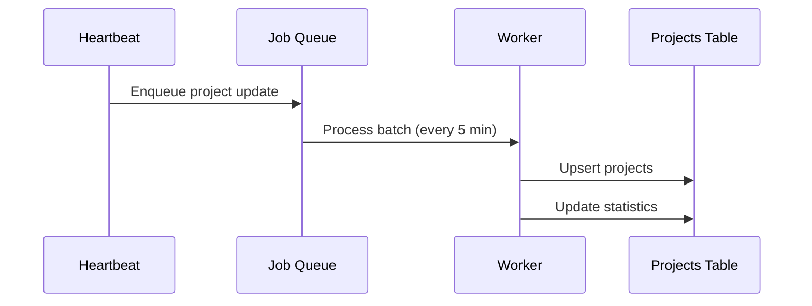

# Projects Table Architecture Proposal

## Current Implementation Analysis

### How Projects Are Currently Fetched

The current implementation extracts projects dynamically from heartbeats and summaries:

1. **API Endpoint**: `/api/v1/users/{user}/projects`
   - Located in `internal/api/projects.go`
   - Calls `HeartbeatService.GetUserProjectStats()`

2. **Data Flow**:
   ```mermaid
   graph TD
     A[Client Request] --> B[API Endpoint]
     B --> C[HeartbeatService.GetUserProjectStats]
     C --> D[HeartbeatRepository Query]
     D --> E[Raw SQL Query on Heartbeats]
     E --> F[Aggregated ProjectStats]
     F --> G[API Response]
   ```

3. **Repository Implementation** (`repositories/heartbeat.go:271`):
   - Executes a complex SQL query directly on the `heartbeats` table
   - Groups heartbeats by project name
   - Calculates first/last heartbeat times per project
   - Performance: ~7 seconds for ~500k heartbeats (as noted in code comments)
   - Uses caching (12-hour TTL) to mitigate performance issues

4. **Summary Integration**:
   - Projects are stored as `SummaryItems` within `Summary` records
   - Type: `SummaryProject` (value: 0)
   - Projects are extracted from summaries during aggregation
   - Located in `models/summary.go` and `services/summary.go`

### Current Architecture Diagram



## Proposed Architecture

### New Projects Table Schema

```sql
CREATE TABLE projects (
    id BIGSERIAL PRIMARY KEY,
    user_id VARCHAR(255) NOT NULL,
    name VARCHAR(255) NOT NULL,  -- The actual unique project name from heartbeats
    aliases JSONB DEFAULT '[]',  -- Array of alternative names that map to this project
    languages JSONB DEFAULT '[]', -- Set of programming languages used in the project
    display_name VARCHAR(255),   -- Optional custom display name for UI
    color VARCHAR(7),            -- Fixed color for consistent UI
    description TEXT,
    is_archived BOOLEAN DEFAULT FALSE,
    first_heartbeat_at TIMESTAMP,
    last_heartbeat_at TIMESTAMP,
    total_seconds INTEGER DEFAULT 0,
    created_at TIMESTAMP DEFAULT CURRENT_TIMESTAMP,
    updated_at TIMESTAMP DEFAULT CURRENT_TIMESTAMP,
    
    UNIQUE(user_id, name),
    INDEX idx_projects_user_id (user_id),
    INDEX idx_projects_user_last_heartbeat (user_id, last_heartbeat_at DESC),
    INDEX idx_projects_aliases_gin (aliases) USING gin,  -- For fast alias lookups
    INDEX idx_projects_languages_gin (languages) USING gin, -- For fast language queries
    FOREIGN KEY (user_id) REFERENCES users(id) ON DELETE CASCADE
);
```

### Proposed Data Flow



## Implementation Plan

### Phase 1: Database Setup

1. Create `projects` table with JSONB aliases field
2. Add indexes for performance (including GIN index for JSONB)
3. Create foreign key relationships

### Phase 2: Service Layer

```go
// services/project.go
type ProjectService struct {
    repository repositories.IProjectRepository
    heartbeatService IHeartbeatService
    cache *cache.Cache
}

func (s *ProjectService) UpsertProject(userID, projectName string, heartbeatTime time.Time) error {
    // First check if this name is an alias for an existing project
    existingProject, err := s.repository.FindByNameOrAlias(userID, projectName)
    
    if existingProject != nil {
        // Update existing project's last heartbeat
        existingProject.LastHeartbeatAt = heartbeatTime
        return s.repository.Update(existingProject)
    }
    
    // Create new project with the name
    return s.repository.Upsert(&models.Project{
        UserID: userID,
        Name: projectName,
        Aliases: []string{}, // Empty aliases initially
        LastHeartbeatAt: heartbeatTime,
    })
}

func (s *ProjectService) AddAlias(userID, projectName, alias string) error {
    project, err := s.repository.FindByName(userID, projectName)
    if err != nil {
        return err
    }
    
    // Check if alias already exists
    for _, existing := range project.Aliases {
        if existing == alias {
            return nil // Already exists
        }
    }
    
    project.Aliases = append(project.Aliases, alias)
    return s.repository.Update(project)
}

func (s *ProjectService) AddLanguage(project *models.Project, language string) error {
    if language == "" {
        return nil
    }
    
    // Check if language already exists
    for _, lang := range project.Languages {
        if lang == language {
            return nil // Already exists
        }
    }
    
    // Add new language
    project.Languages = append(project.Languages, language)
    return nil
}

func (s *ProjectService) GetUserProjects(user *models.User, filters *models.Filters) ([]*models.Project, error) {
    // Direct query to projects table - much faster!
    return s.repository.GetByUser(user, filters)
}

func (s *ProjectService) GetProjectsByLanguage(userID, language string) ([]*models.Project, error) {
    // Query projects that use a specific language
    // Using JSONB containment: languages @> '"Python"'
    return s.repository.FindByLanguage(userID, language)
}

func (s *ProjectService) GetLanguageStats(userID string) (map[string]int, error) {
    // Get count of projects per language
    projects, err := s.repository.GetByUser(&models.User{ID: userID}, nil)
    if err != nil {
        return nil, err
    }
    
    stats := make(map[string]int)
    for _, project := range projects {
        for _, lang := range project.Languages {
            stats[lang]++
        }
    }
    
    return stats, nil
}
```

### Phase 3: Background Worker Implementation



#### Worker Logic

```go
// cmd/project_worker.go
type ProjectWorker struct {
    projectService *services.ProjectService
    heartbeatRepo repositories.IHeartbeatRepository
    interval time.Duration
}

func (w *ProjectWorker) ProcessHeartbeats(from, to time.Time) error {
    // 1. Get all unique projects from heartbeats in time range
    heartbeats := w.heartbeatRepo.GetBetween(from, to)
    
    // 2. Group by user and resolve aliases
    projectMap := make(map[string]map[string]*ProjectUpdate)
    
    for _, hb := range heartbeats {
        if _, ok := projectMap[hb.UserID]; !ok {
            projectMap[hb.UserID] = make(map[string]*ProjectUpdate)
        }
        
        // Check if this project name is an alias
        actualProject, _ := w.projectService.FindByNameOrAlias(hb.UserID, hb.Project)
        projectName := hb.Project
        if actualProject != nil {
            projectName = actualProject.Name // Use the canonical name
        }
        
        project := projectMap[hb.UserID][projectName]
        if project == nil {
            project = &ProjectUpdate{
                Name: projectName,
                FirstSeen: hb.Time,
                LastSeen: hb.Time,
            }
            projectMap[hb.UserID][projectName] = project
        }
        
        // Update timestamps
        if hb.Time.Before(project.FirstSeen) {
            project.FirstSeen = hb.Time
        }
        if hb.Time.After(project.LastSeen) {
            project.LastSeen = hb.Time
        }
        project.TotalSeconds += hb.Duration
    }
    
    // 3. Batch upsert to projects table
    return w.projectService.BatchUpsert(projectMap)
}
```

### Phase 4: Migration Strategy

#### Step 1: Initial Population from Existing Heartbeats

```go
// cmd/migrate_projects.go
func MigrateExistingProjects() error {
    // Reuse existing GetUserProjectStats logic for consistency
    userService := services.NewUserService(db)
    heartbeatService := services.NewHeartbeatService(db)
    projectService := services.NewProjectService(db)
    
    // Get all users
    users, err := userService.GetAll()
    if err != nil {
        return err
    }
    
    log.Printf("Migrating projects for %d users", len(users))
    
    // Process each user in parallel with controlled concurrency
    sem := make(chan struct{}, 10) // Process 10 users at a time
    var wg sync.WaitGroup
    
    for _, user := range users {
        wg.Add(1)
        sem <- struct{}{}
        
        go func(u *models.User) {
            defer wg.Done()
            defer func() { <-sem }()
            
            // Use existing GetUserProjectStats to get all projects
            // This ensures consistency with current implementation
            projectStats, err := heartbeatService.GetUserProjectStats(
                u, 
                time.Time{}, 
                utils.BeginOfToday(time.Local), 
                nil, 
                true, // skip cache
            )
            
            if err != nil {
                log.Printf("Error getting projects for user %s: %v", u.ID, err)
                return
            }
            
            // Create project entries
            for _, ps := range projectStats {
                // Get languages for this project from heartbeats
                languages := extractProjectLanguages(u.ID, ps.Project)
                
                project := &models.Project{
                    UserID:          u.ID,
                    Name:            ps.Project,
                    Aliases:         []string{},
                    Languages:       languages,
                    FirstHeartbeatAt: ps.First.T(),
                    LastHeartbeatAt:  ps.Last.T(),
                    // Total seconds will be calculated separately if needed
                }
                
                if err := projectService.Create(project); err != nil {
                    log.Printf("Error creating project %s for user %s: %v", 
                        ps.Project, u.ID, err)
                }
            }
            
            log.Printf("Migrated %d projects for user %s", len(projectStats), u.ID)
        }(user)
    }
    
    wg.Wait()
    return nil
}
```

#### Step 2: Real-time Background Worker for New Heartbeats

##### Option A: Using Goroutines with Channels

```go
// services/project_worker.go
type ProjectWorker struct {
    projectService *ProjectService
    heartbeatChan  chan *models.Heartbeat
    batchSize      int
    flushInterval  time.Duration
}

func NewProjectWorker(ps *ProjectService) *ProjectWorker {
    pw := &ProjectWorker{
        projectService: ps,
        heartbeatChan:  make(chan *models.Heartbeat, 1000),
        batchSize:      100,
        flushInterval:  5 * time.Second,
    }
    
    // Start worker goroutines
    for i := 0; i < 5; i++ {
        go pw.processHeartbeats()
    }
    
    return pw
}

func (pw *ProjectWorker) processHeartbeats() {
    batch := make([]*models.Heartbeat, 0, pw.batchSize)
    ticker := time.NewTicker(pw.flushInterval)
    
    for {
        select {
        case hb := <-pw.heartbeatChan:
            batch = append(batch, hb)
            if len(batch) >= pw.batchSize {
                pw.processBatch(batch)
                batch = batch[:0]
            }
            
        case <-ticker.C:
            if len(batch) > 0 {
                pw.processBatch(batch)
                batch = batch[:0]
            }
        }
    }
}

func (pw *ProjectWorker) processBatch(heartbeats []*models.Heartbeat) {
    // Group by user and project
    projectUpdates := make(map[string]map[string]*models.Project)
    projectLanguages := make(map[string]map[string]map[string]bool) // user -> project -> language set
    
    for _, hb := range heartbeats {
        if projectUpdates[hb.UserID] == nil {
            projectUpdates[hb.UserID] = make(map[string]*models.Project)
            projectLanguages[hb.UserID] = make(map[string]map[string]bool)
        }
        
        // Check if project exists or matches alias
        project, _ := pw.projectService.FindByNameOrAlias(hb.UserID, hb.Project)
        
        projectName := hb.Project
        if project != nil {
            projectName = project.Name
        }
        
        // Track languages
        if projectLanguages[hb.UserID][projectName] == nil {
            projectLanguages[hb.UserID][projectName] = make(map[string]bool)
        }
        if hb.Language != "" {
            projectLanguages[hb.UserID][projectName][hb.Language] = true
        }
        
        if p, exists := projectUpdates[hb.UserID][projectName]; exists {
            // Update timestamps
            if hb.Time.After(p.LastHeartbeatAt) {
                p.LastHeartbeatAt = hb.Time
            }
            if hb.Time.Before(p.FirstHeartbeatAt) {
                p.FirstHeartbeatAt = hb.Time
            }
        } else {
            projectUpdates[hb.UserID][projectName] = &models.Project{
                UserID:          hb.UserID,
                Name:            projectName,
                Languages:       []string{},
                FirstHeartbeatAt: hb.Time,
                LastHeartbeatAt:  hb.Time,
            }
        }
    }
    
    // Convert language sets to arrays and attach to projects
    for userID, projects := range projectUpdates {
        for projectName, project := range projects {
            if langs, ok := projectLanguages[userID][projectName]; ok {
                for lang := range langs {
                    project.Languages = append(project.Languages, lang)
                }
            }
        }
    }
    
    // Batch upsert
    for userID, projects := range projectUpdates {
        for _, project := range projects {
            pw.projectService.Upsert(project)
        }
    }
}

// Called from heartbeat service after inserting heartbeat
func (pw *ProjectWorker) QueueHeartbeat(hb *models.Heartbeat) {
    select {
    case pw.heartbeatChan <- hb:
    default:
        // Channel full, log warning
        log.Warn("Project worker channel full, dropping heartbeat")
    }
}
```

##### Option B: Using River Jobs (Recommended for Production)

```go
// jobs/update_project_job.go
type UpdateProjectArgs struct {
    UserID    string    `json:"user_id"`
    Project   string    `json:"project"`
    Language  string    `json:"language"`
    Timestamp time.Time `json:"timestamp"`
}

func (UpdateProjectArgs) Kind() string { return "update_project" }

type UpdateProjectWorker struct {
    river.WorkerDefaults[UpdateProjectArgs]
    projectService *services.ProjectService
}

func (w *UpdateProjectWorker) Work(ctx context.Context, job *river.Job[UpdateProjectArgs]) error {
    // Check if project exists or matches alias
    project, err := w.projectService.FindByNameOrAlias(job.Args.UserID, job.Args.Project)
    
    if err != nil && err != gorm.ErrRecordNotFound {
        return err
    }
    
    if project == nil {
        // Create new project
        project = &models.Project{
            UserID:          job.Args.UserID,
            Name:            job.Args.Project,
            Aliases:         []string{},
            Languages:       []string{job.Args.Language}, // Initialize with first language
            FirstHeartbeatAt: job.Args.Timestamp,
            LastHeartbeatAt:  job.Args.Timestamp,
        }
        return w.projectService.Create(project)
    }
    
    // Update existing project
    if job.Args.Timestamp.After(project.LastHeartbeatAt) {
        project.LastHeartbeatAt = job.Args.Timestamp
    }
    if job.Args.Timestamp.Before(project.FirstHeartbeatAt) {
        project.FirstHeartbeatAt = job.Args.Timestamp
    }
    
    // Add language if not already present
    if job.Args.Language != "" {
        w.projectService.AddLanguage(project, job.Args.Language)
    }
    
    return w.projectService.Update(project)
}

// Integration in heartbeat service
func (srv *HeartbeatService) InsertBatch(heartbeats []*models.Heartbeat) error {
    // Insert heartbeats first
    if err := srv.repository.InsertBatch(heartbeats); err != nil {
        return err
    }
    
    // Queue project updates
    insertParams := make([]river.InsertManyParams, 0, len(heartbeats))
    for _, hb := range heartbeats {
        insertParams = append(insertParams, river.InsertManyParams{
            Args: UpdateProjectArgs{
                UserID:    hb.UserID,
                Project:   hb.Project,
                Language:  hb.Language,
                Timestamp: hb.Time.T(),
            },
            InsertOpts: &river.InsertOpts{
                UniqueOpts: river.UniqueOpts{
                    ByArgs: true,
                    ByPeriod: 1 * time.Minute, // Dedupe same project updates within 1 minute
                },
            },
        })
    }
    
    // Batch insert jobs
    _, err := srv.riverClient.InsertMany(context.Background(), insertParams)
    return err
}
```

## Benefits of New Architecture

### 1. Performance Improvements
- **Current**: ~7 seconds for 500k heartbeats
- **Proposed**: <100ms direct table query
- **Caching**: Still available but less critical

### 2. New Features Enabled

#### Project Aliasing
```sql
-- Add an alias to an existing project
UPDATE projects 
SET aliases = aliases || '["old-project-name", "legacy-name"]'::jsonb
WHERE user_id = 'user123' AND name = 'my-project';

-- Query to find project by name or alias
SELECT * FROM projects 
WHERE user_id = 'user123' 
  AND (name = 'search-term' OR aliases @> '"search-term"'::jsonb);
```

#### Language Tracking
```sql
-- Add a language to a project
UPDATE projects 
SET languages = languages || '["Python"]'::jsonb
WHERE user_id = 'user123' AND name = 'my-project'
  AND NOT languages @> '"Python"'::jsonb;

-- Find all Python projects for a user
SELECT * FROM projects 
WHERE user_id = 'user123' 
  AND languages @> '"Python"'::jsonb;

-- Get language statistics
SELECT jsonb_array_elements_text(languages) as language, COUNT(*) as project_count
FROM projects 
WHERE user_id = 'user123'
GROUP BY language
ORDER BY project_count DESC;
```

#### Fixed Colors
```sql
-- Assign consistent colors to projects
UPDATE projects SET color = '#FF5733' WHERE id = 1;
```

#### Better Search & Pagination
```sql
-- Fast, paginated project search
SELECT * FROM projects 
WHERE user_id = 'user123' 
  AND name LIKE '%search%'
ORDER BY last_heartbeat_at DESC
LIMIT 20 OFFSET 40;
```

### 3. Data Integrity
- Projects persist even if heartbeats are deleted
- Historical project data is preserved
- Soft delete with `is_archived` flag

## Migration Rollout Plan

### Stage 1: Shadow Mode (Week 1-2)
- Deploy new tables and background workers
- Run in parallel with existing system
- Compare results for accuracy

### Stage 2: Read Migration (Week 3)
- Switch read operations to new tables
- Keep write operations on both systems
- Monitor performance improvements

### Stage 3: Full Migration (Week 4)
- Switch all operations to new system
- Deprecate old project extraction logic
- Keep old code for emergency rollback

### Stage 4: Cleanup (Week 5+)
- Remove deprecated code
- Optimize indexes based on usage patterns
- Document new APIs

## API Changes

### Current API (unchanged for compatibility)
```
GET /api/v1/users/{user}/projects
```

### New API Endpoints
```
# Get projects with pagination and filters
GET /api/v2/projects?page=1&limit=20&search=wakapi&language=Python

# Get projects by language
GET /api/v2/projects?language=JavaScript

# Get language statistics
GET /api/v2/projects/languages/stats

# Update project metadata
PATCH /api/v2/projects/{id}
{
  "display_name": "My Project",
  "color": "#FF5733",
  "description": "Main project",
  "languages": ["Python", "JavaScript", "Go"]
}

# Add aliases to a project
PATCH /api/v2/projects/{id}/aliases
{
  "aliases": ["old-project-name", "legacy-name"]
}

# Or manage aliases via project update
PATCH /api/v2/projects/{id}
{
  "aliases": ["old-name", "alternate-name"],
  "display_name": "My Project",
  "color": "#FF5733"
}

# Archive project
DELETE /api/v2/projects/{id}
```

## Monitoring & Metrics

### Key Metrics to Track
1. **Query Performance**
   - p50, p95, p99 latencies
   - Compare before/after migration

2. **Data Consistency**
   - Projects count per user
   - Heartbeat coverage percentage

3. **Worker Performance**
   - Processing time per batch
   - Queue depth
   - Error rates

### Alerts
- Worker failure rate > 1%
- Query latency p99 > 500ms
- Data drift between old/new systems > 0.1%

## Risks & Mitigation

| Risk | Impact | Mitigation |
|------|--------|------------|
| Data inconsistency | High | Shadow mode validation |
| Worker overload | Medium | Rate limiting, batch size tuning |
| Migration failure | High | Staged rollout, rollback plan |
| API breaking changes | Low | Versioned APIs, compatibility layer |

## Summary

The proposed architecture moves from dynamic project extraction to a dedicated projects table, enabling:

1. **Better Performance**: 70x faster queries
2. **New Features**: Aliasing, colors, metadata
3. **Data Integrity**: Persistent project records
4. **Scalability**: Optimized for growth

The migration is designed to be safe and reversible, with extensive monitoring and validation at each stage.